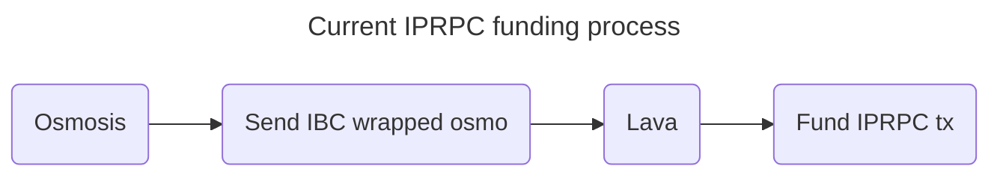
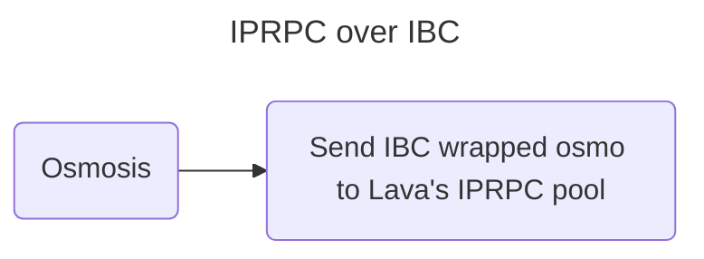
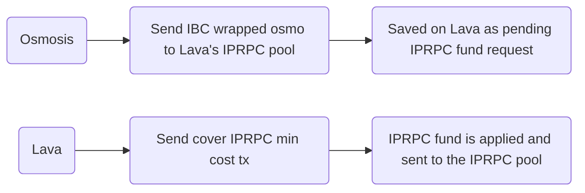

# Objective

Let users of IBC enabled chains fund IPRPC directly from their chains (and not only from Lava).

# Summary

Incentivized Provider RPC (or IPRPC) is a program designed to motivate providers to offer services for specific chains using Lava. Providers supplying RPC data for chain X will receive additional rewards from the IPRPC pool each month. This pool is funded by chain X's DAO and other contributors.

Currently, funding the IPRPC pool requires the funder to transfer IBC tokens to Lava and send a TX to fund the pool. To ease the funding process, this feature will allow funding Lava’s IPRPC pool directly from the other chain using a custom IBC-transfer packet.




# Success Metrics

- Enable users from IBC enabled chains to fund the IPRPC pool directly using a custom IBC-transfer packet.
- Other IBC packets are still handled normally.
- Funding IPRPC using Lava’s `fund-iprpc` TX still works normally.

# Approach

There were two possible approaches to solve this problem:

- Implement a custom IBC middleware for IBC-transfer packets. This is done by making the rewards module the middleware, allowing it to inspect IBC-transfer packets and get the relevant ones for funding the IPRPC pool.
- Implement IBC hooks for IBC-transfer packets. This is done by implementing IBC hooks that are triggered when an `ibc-transfer` TX happens to decide whether the transfer should be handled normally or directed to the IPRPC pool.

The first approach was chosen because it’s easier to implement.

The process of funding the IPRPC pool using IBC will be as follows:



# Detailed Design

## Queries

| Name | Arguments | What it does |
| --- | --- | --- |
| generate-ibc-iprpc-memo  | spec string duration uint64 funds sdk.Coins optional flag: --escaped | Helper query to create the JSON required in the memo field of ibc-transfer packet to make it fund Lava’s IPRPC pool. The --escaped flag produces a one-line escaped version of the JSON, fitted for CLI. |
| pending-ibc-iprpc-funds | optional arg: moniker string | Shows the pending IBC IPRPC fund requests. If a moniker is given, show only the ones that were created by it.

## TXs

| Name | Arguments | What it does |
| --- | --- | --- |
| cover-iprpc-min-cost | creator string index uint64 | Lets a Lava account pay the minimum cost for a pending IBC IPRPC fund by index |


## On-chain Objects

| Name | Arguments | What it does |
| --- | --- | --- |
| ibc-iprpc-fund | index uint64 creator string spec string duration uint64 funds sdk.Coins | Scaffolded map to keep track of IPRPC funding requests from IBC. The creator field is the moniker of the original issuer of the ibc-transfer query (which wasn’t on the Lava chain) |


## Implementation Details

To make the rewards module an IBC middleware module, it needs to implement the interface specified [here](https://github.com/cosmos/ibc-go/blob/v7.0.0/modules/core/05-port/types/module.go). We take reference from the [packet-forward-middleware implementation](https://www.notion.so/99f066abe86b410783515056488d69a1?pvs=21). Our middleware will be after the packet forward middleware on the transfer stack (the stack of IBC modules that operate when an `ibc-transfer` packet is received).

To fund the IPRPC pool, the creator has to pay minimum costs in Lava tokens. So the funding through IBC will be put on hold until a deposit will be submitted.

## IBC Middleware

```go
// x/rewards/ibc_middleware.go

var _ porttypes.Middleware = &IBCMiddleware{}

// IBCMiddleware implements the ICS26 callbacks for the transfer middleware given
// the rewards keeper and the underlying application.
type IBCMiddleware struct {
	app    porttypes.IBCModule // will be the transfer stack
	keeper *keeper.Keeper
}

// NewIBCMiddleware creates a new IBCMiddleware given the keeper and underlying application
func NewIBCMiddleware(k keeper.Keeper, app porttypes.IBCModule) IBCMiddleware {
	return IBCMiddleware{
		Module: ibc.NewModule(app),
		keeper: k,
	}
}

// OnRecvPacket calls the keeper's OnRecvPacket callback
func (im IBCMiddleware) OnRecvPacket(ctx sdk.Context, packet channeltypes.Packet, relayer sdk.AccAddress) exported.Acknowledgement

// ICS4Wrapper interface (default implementations)
func (im IBCMiddleware) SendPacket(ctx sdk.Context, chanCap *capabilitytypes.Capability, sourcePort string, sourceChannel string, 
	timeoutHeight clienttypes.Height, timeoutTimestamp uint64, data []byte) (sequence uint64, err error)

func (im IBCMiddleware) WriteAcknowledgement(ctx sdk.Context, chanCap *capabilitytypes.Capability, packet exported.PacketI, 
	ack exported.Acknowledgement) error

func (im IBCMiddleware) GetAppVersion(ctx sdk.Context, portID, channelID string) (string, bool)
```

```go
// x/rewards/keeper/ibc_callbacks.go

// OnRecvPacket which handles the IBC IPRPC fund request uses the ibc-transfer packet's memo. An example of a valid memo:
//
/*
		{
		  "iprpc": {
		    "creator": "my-moniker",
		    "spec": "ETH1",
		    "duration": "3"
		  }
		}
*/

// OnRecvPacket does the following (ref: https://github.com/cosmos/ibc-go/blob/v7.0.0/modules/apps/29-fee/ibc_middleware.go#L217-L238):
// 1. checks the packet's memo. Not valid -> do nothing and transfer the packet to the transfer stack
// 2. if valid, extract the memo's paramenters and change the ibc-transfer packet's receiver to be the rewards module address. Also,
//    make the memo be empty.
// 3. call the transfer stack's OnRecvPacket with the modified packet -> the rewards module will get the IBC tokens
// 4. set a new IbcIprpcFund with the parameters from the memo (see below in the "IBC IPRPC fund" section)
func (k Keeper) OnRecvPacket(ctx sdk.Context, packet channeltypes.Packet, relayer sdk.AccAddress) exported.Acknowledgement

// ValidateIprpcMemo checks that the memo's extracted creator, spec and duration fields are valid
func (k Keeper) IsIprpcMemoValid(creator string, spec string, duration uint64) bool
```

```go
// x/rewards/keeper/keeper.go

type Keeper struct {
	...
	ics4Wrapper    porttypes.ICS4Wrapper  // no-op wrapper used to satisfy the ICS4 interface
}
```

```go
// app/app.go

func New(...) *LavaApp {
	transferStack = transfer.NewIBCModule(app.TransferKeeper)
	...
	transferStack = rewards.NewIBCMiddleware(*app.RewardsKeeper, transferStack)
	...
}
```

```proto
// proto/lavanet/lava/rewards/query.proto

// The generate-ibc-iprpc-memo is a helper query the generates the required JSON memo to make the ibc-transfer query fund Lava's 
// IPRPC pool. The query's help will present an example JSON as reference.

message QueryGenerateIbcIprpcMemoRequest {
  string spec = 1;
  uint64 duration = 2;
  repeated cosmos.base.v1beta1.Coin funds = 3 [
        (gogoproto.castrepeated) = "github.com/cosmos/cosmos-sdk/types.Coins",
        (gogoproto.nullable)     = false
    ];
}

message QueryGenerateIbcIprpcMemoResponse {
  string memo = 1;
}

message QueryPendingIbcIprpcFundsRequest {
  string moniker = 1;
}

message QueryPendingIbcIprpcFundsResponse {
  repeated IbcIprpcFunds funds = 1;
}

// Full implementation of the queries will be in the rewards keeper
```

## IBC IPRPC fund

```proto
// proto/lavanet/lava/rewards/iprpc.proto

// Scaffolded map that holds iprpc fund requests information with increasing index (latest index will be saved as an on-chain single)
// The iprpc fund will be applied and transferred to the IPRPC pool once a Lava account will issue a cover-iprpc-min-cost TX

message IbcIprpcFund {
		uint64 index = 1;     // unique index
    string creator = 2;   // creator moniker
    string spec = 3;
    uint64 duration = 4;  // in months
    repeated cosmos.base.v1beta1.Coin funds = 5 [
        (gogoproto.castrepeated) = "github.com/cosmos/cosmos-sdk/types.Coins",
        (gogoproto.nullable)     = false
    ];
}

// Full implementation of the scaffolded map will be in the rewards keeper
```

```proto
// proto/lavanet/lava/rewards/tx.proto

// The cover-iprpc-min-cost lets a Lava account pay the minimum cost for a pending IBC IPRPC fund. If the account has the required
// funds, the corresponding IbcIprpcFund will be deleted

message MsgCoverIprpcMinCost {
    string creator = 1;
    uint64 index = 2;    // IbcIprpcFund index to cover costs for
}

// Full implementation of the TX will be in the rewards keeper
```

```go
// x/rewards/keeper/iprpc.go

func (k Keeper) FundIprpc(ctx sdk.Context, creator string, duration uint64, fund sdk.Coins, spec string) error {
	// handle case that the creator is only covering the min cost and the IPRPC funding comes from the rewards module
}
```

## README

```
// x/rewards/README.md

// update the readme with the new IPRPC funding mechanism
```

## Units Tests
- IPRPC fund TX still requires min cost (should already be implemented).
- IBC middleware mechanism:
    - `ibc-transfer` with no memo → behaves normally
    - `ibc-transfer` with valid IPRPC memo → sets an IbcIprpcFund object, rewards module get funds and returns normally
    - `ibc-transfer` with invalid IPRPC memo → return error
    - `ibc-transfer` with memo that is not related to IPRPC memo → behaves normally
- Cover minimum IPRPC cost TX mechanism:
    - If valid, fund the IPRPC pool and delete the corresponding IbcIprpcFund object
- Pending IBC IPRPC funds query:
    - With/without moniker
    - After covering one of the minimum IPRPC costs, check that updated map is returned
- Generate IPRPC memo query:
    - With/without escaped flag

## Backwards Compatibility

There are no backwards compatibility issues.

## Security Considerations

No security considerations.

## Open issues / questions

| Question / Issue | Answer | Date Answered |
| --- | --- | --- |
| Should we define an expiration time for pending IBC IPRPC fund requests? If so, should we send back funds? should we make the expiration time a param? | | |		
| Should we support funding multiple specs with different amount over IBC? | | |		
| Should we develop an IBC testing infrastructure that simulates the whole IBC transfer process? (ref: EVMOS recovery module from v15.0.0). Could cause a major delay | | |

## References
* https://github.com/strangelove-ventures/packet-forward-middleware
* https://ibc.cosmos.network/main/ibc/middleware/overview
* https://github.com/evmos/evmos/tree/release/v15.0.x/x/recovery
